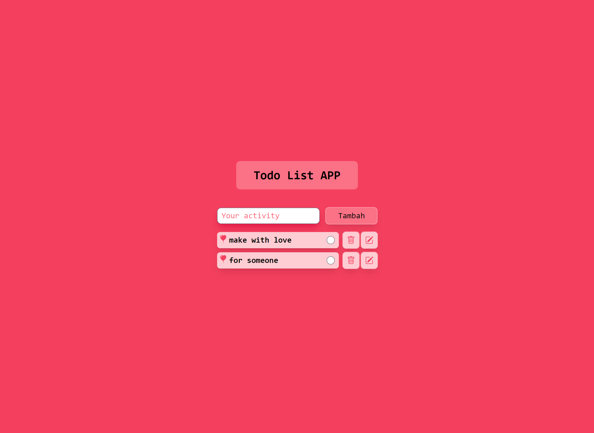

# ROSE THEME APPLICATION

## Tampilan Aplikasi

1. Tampilan depan aplikasi

   

   <!-- prettier-ignore -->
   

    <a href="https://your-activity.vercel.app" target="_blank" style="background-color: #FC98A5; color: white; padding: 5px; border-radius: 5px;">Intip Aplikasi</a>
   

## Teknologi yang di gunakan

- [NextJs](https://nextjs.org/)
- [Tailwindcss](https://tailwindcss.com//)
- [HeadlessUI](https://headlessui.dev/)

## Referensi

### Artikel

- [Website MDN (Java Script)](https://developer.mozilla.org/en-US/docs/Web/HTML)

### Video

- [The final project (todo list app)](https://www.youtube.com/watch?v=JS5w4rUbjQE&t=12766s)

<!-- markdownlint-restore -->
<!-- prettier-ignore-end -->

<!-- ALL-CONTRIBUTORS-LIST:END -->

---

Dibuat menggunakan NextJS. Kode berlisensi dibawah [MIT License](https://github.com/faruqmaulana/rose-theme-application/main/LICENSE)
